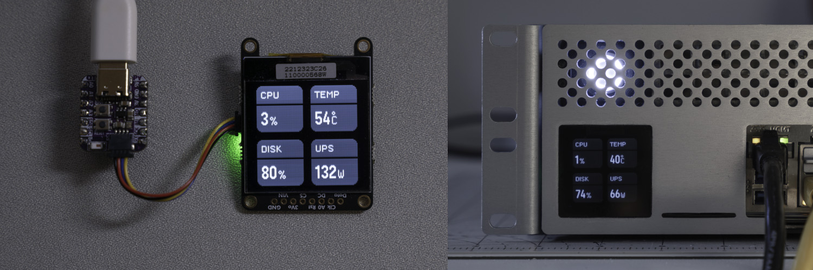

# Arduino Homelab Display

ESP32-based status display for various server metrics forked from  [phlntn/IntnArduino_HomelabDisplay](https://github.com/phlntn/Arduino_HomelabDisplay)

Implements reading the following sensors:
- CPU temperature via a very rudimentary IPMI client implemention
- Proxmox CPU usage via its HTTP API
- TrueNAS disk usage via SNMP
- UPS power draw via SNMP
- CPU usage via SNMP (unused by default)

Additional functionality:
- Web interface for remote viewing or embedding of current sensor values
- Over-the-air firmware updates via ArduinoOTA

This is a personal project that is only tested with the hardware/software listed below — it is not a general-purpose application. Please create a fork if you'd like to extend the code.
- ASRock Rack D2163D4I2-2T
- Proxmox 8.3
- TrueNAS Scale 24.10
- Eaton 5P 1500 RC with Gigabit Network Card

## Parts

- [Adafruit QT Py ESP32 Pico](https://www.adafruit.com/product/5395)
- [Adafruit Grayscale 1.5" 128x128 OLED](https://www.adafruit.com/product/4741)
- [Adafruit STEMMA 4-Pin Cable](https://www.adafruit.com/product/4399)

## Setup

1. Install Arduino libraries:
   - Adafruit GFX Library
   - Adafruit SSD1327
   - SNMP Manager
   - ArduinoJson (not Arduino_JSON)
2. Copy `Secrets.example.h` to `Secrets.h` and configure
3. Compile and upload code to ESP32

## Code Documentation (in progress)
https://learn.adafruit.com/adafruit-gfx-graphics-library/using-fonts

## Acknowledgments

- Custom fonts created with [GFX Font Editor](https://github.com/ScottFerg56/GFXFontEditor)
- Partially developed with Anthropic Claude
