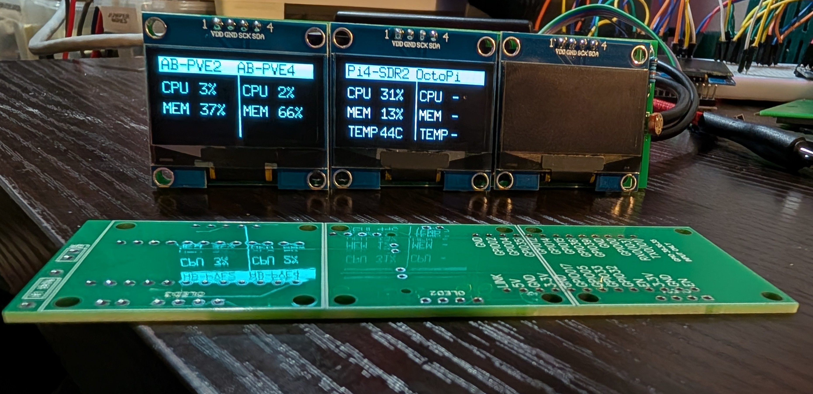
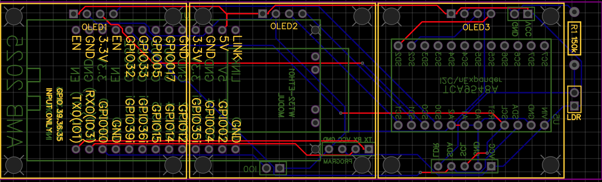

# Arduino Homelab Display V2

ESP32-based status display for various server metrics forked from [phlntn](https://github.com/phlntn/Arduino_HomelabDisplay)

###Implements reading the following sensors:
- Temperature, CPU, Memory usage via Flask API
- CPU temperature via a very rudimentary IPMI client implemention
- Proxmox CPU usage via its HTTP API
- TrueNAS disk usage via SNMP
- UPS power draw via SNMP
- CPU usage via SNMP (unused by default)

###Additional functionality:
- Support for multiple SH1106 displays using a TCA9548A I2C Multiplexer
- Web interface for remote viewing or embedding of current sensor values
- Over-the-air firmware updates via ArduinoOTA

## Parts

1. WT-ETH01 ESP32 Ethernet
2. POE module (optional)
3. TCA9548A I2C Multiplexer
4. SH1106 (as many as you want)
5. Light Dependant Resistor and 150k Ohm Resistor (optional)

## Setup

1. Install Arduino libraries:
   - Adafruit GFX Library
   - Adafruit SSD1327
   - SNMP Manager
   - ArduinoJson (not Arduino_JSON)
   - U8g2lib
2. Update secrets.h and configure
3. Compile and upload code to ESP32
      Note: When uploading to the WT-ETH01 IO0 must be grounded when connecting the programmer.

## PCB

## Acknowledgments

- Custom fonts created with [GFX Font Editor](https://github.com/ScottFerg56/GFXFontEditor)
- Partially developed with Anthropic Claude and Copilot
- Forked from [phlntn](https://github.com/phlntn/Arduino_HomelabDisplay)
